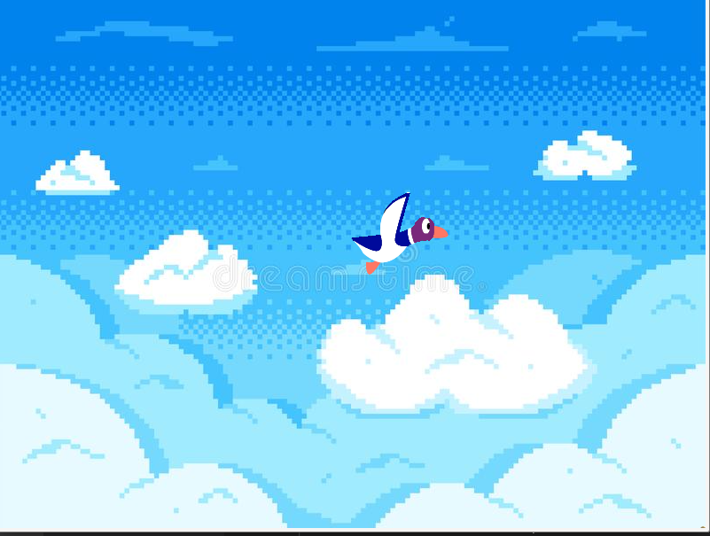

# MY_HUNTER

The goal of this project is to make a small video game based on the rules of Duck Hunt.The basic rules for the my_hunter are as follows:

  •the player is a hunter who shoots ducks. <br>
  •ducks must appear on the screen and move from one side to another. <br>
  •the player can click on them to shoot them <br>

To compile use : <br>

```python
make
```
<br>

```python
./my_hunter
```
### Screenshot

<!--  -->


