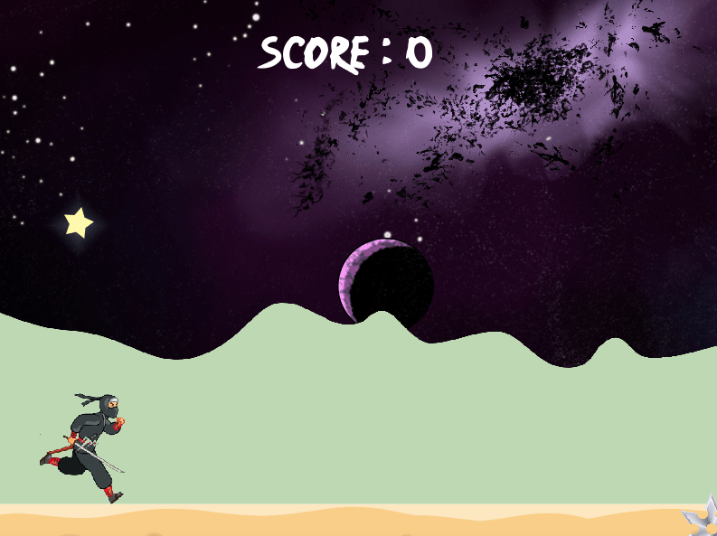

# MY_RUNNER

In this project, you are asked to make a small video game based on the rules of a finite Endless Running Game (like Mario Bross).The basic rules for the my_runner are as follows:<br><br>
•the player is a character who runs in a map you took as parameter. <br>
•enemies and obstacles must appear on the opposite side to the player position. <br>
•the player can use the space bar to jump and avoid obstacles and enemies. <br>
•as the player runs, a score, which will be displayed, will increase.<br>
•when the player dies or finishes the map, the score is displayed inside the window<br>

***

To compile use : <br>

```python
make
```
<br>and then<br>

```python
./my_runner [maps/map.txt]
```

***

### Screenshot

<kbd>

</kbd>