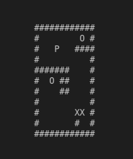

# MY_SOKOBAN

The goal of this project is to develop a copy of the famous sokoban game in terminal mode, using the ncurses library. If all boxes are on storage locations, the player wins and the program must return 0.

>Sokoban (warehouse keeper in Japanese) is a type of transport puzzle, in which the player pushes boxes or crates around in a warehouse, trying to get them tostorage locations.

***

To compile use : <br>

```python
make
```
<br>and then<br>

```python
./my_sokoban [maps/map_1]
```

***

### Screenshot

<kbd>

</kbd>