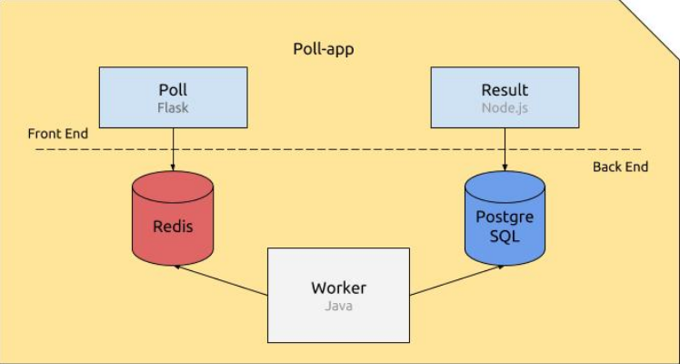

# POPEYE

The goal of this project is to containerize and define the deployment of a simple web poll application using docker.<br><br>


There are five elements constituting the application:<br><br>
-Poll, a Flask Python web application that gathers votes and push them into a Redis queue.<br>
- A Redis queue, which holds the votes sent by the Poll application, awaiting for them to be consumed by the Worker.<br>
- The Worker, a Java application which consumes the votes being in the Redis queue, and stores them intoa Postgre SQL database.<br>
- APostgreSQL database, which (persistently) stores the votes stored by the Worker.<br>
-Result, a Node.js web application that fetches thevotes from the data base and displays the... well,result.;)<br>

***

<br>Compile using :<br>

```python
docker compose -build
```
***

### Schema

<kbd>

</kbd>
